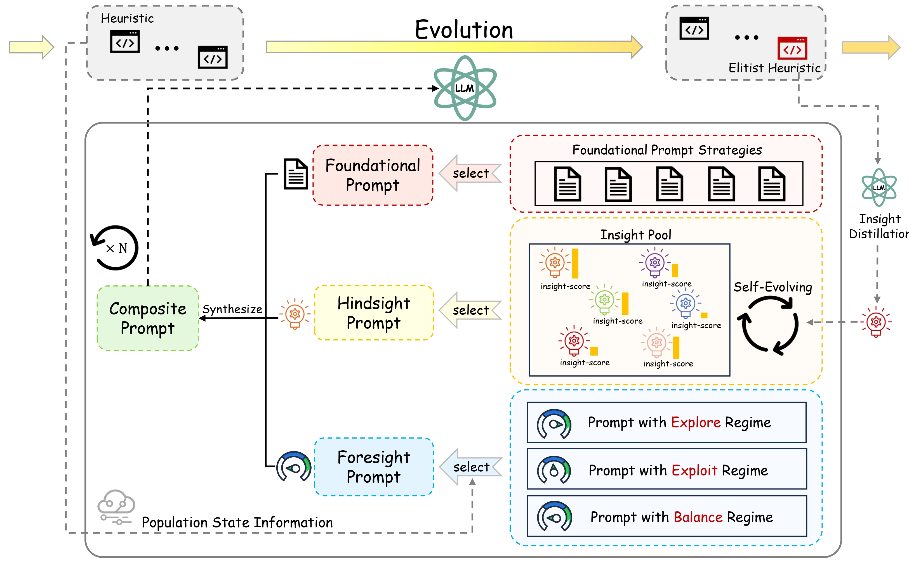
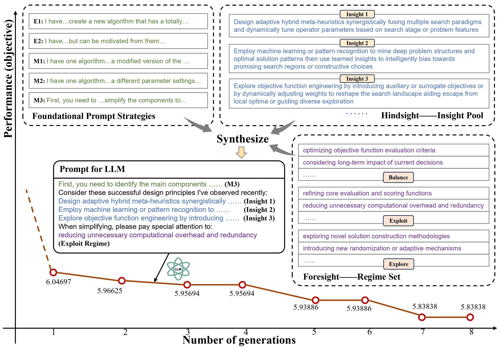

<div align="center">

<h1 align="center">HiFo-Prompt</h1>

<h3 align="center">Prompting with Hindsight and Foresight for LLM-based Automatic Heuristic Design</h3>

<p align="center">
<strong>🧠 Hindsight Insight Pool</strong> · <strong>🔭 Foresight Evolutionary Navigator</strong> · <strong>🔄 Closed-Loop Evolution</strong>
</p>


[English](./README.md) · [中文 (Chinese)](./README_CN.md)

</div>

<br/>

## 📢 News

- **Jan. 2026**: 🎉🎉 HiFo-Prompt: Prompting with Hindsight and Foresight for LLM-based Automatic Heuristic Design has been accepted at **ICLR 2026** as a Poster!
<br/>


## 📖 Introduction

<div align="center">
  
  <p><em>The framework of HiFo-Prompt</em></p>
</div>

**HiFo-Prompt** (Hindsight-Foresight Prompt) is a novel framework for **Automatic Heuristic Design (AHD)** that synergizes **Large Language Models (LLMs)** with **Evolutionary Computation (EC)**.

Existing LLM-based methods often suffer from *short-term memory* (forgetting successful tricks) and *lack of direction* (randomly searching without a strategy). HiFo-Prompt solves this by introducing two key mechanisms:

- **🧠 Hindsight (The Insight Pool)**: A self-evolving knowledge base that distills and stores "design principles" from high-performing heuristics, preventing the system from reinventing the wheel.

- **🔭 Foresight (The Evolutionary Navigator)**: A meta-controller that monitors population dynamics (stagnation, diversity) and actively switches search regimes (*Explore*, *Exploit*, or *Balance*) via specific **Design Directives**.

<br/>

<div align="center">
  
  <p><em>Dynamic prompt generation process of HiFo-Prompt</em></p>
</div>

## 🔥 Key Features

| Component | Function | Why it matters |
|-----------|----------|----------------|
| **Insight Pool** | Extracts & Reuses Knowledge | Instead of discarding parents, we extract *why* they worked. The prompts are augmented with proven "Insights". |
| **Evolutionary Navigator** | Adaptive Control | Detects if the search is stuck (stagnation) or too narrow (low diversity) and dynamically adjusts the prompt strategy. |
| **Decoupled Evaluation** | Efficient Pipeline | Decouples "Thought" from "Code", allowing for faster iteration and lower token consumption compared to standard methods. |

<br/>

## 🛠️ Installation

We recommend using **Conda** to manage the environment.

```bash
# 1. Create environment
conda create -n hifo python=3.10
conda activate hifo

# 2. Clone repository
git clone https://github.com/Challenger-XJTU/HiFo-Prompt.git
cd HiFo

# 3. Install dependencies
cd hifo
pip install .
```

<br/>

## 🚀 Quick Start

> **Note**: You must have an LLM API key (e.g., OpenAI, DeepSeek, Qwen) or a local LLM server running.

### 1. Basic Usage Structure

```python
from hifo import hifo
from hifo.utils.getParas import Paras

# 1. Initialize Parameters
paras = Paras() 

# 2. Configure HiFo
paras.set_paras(
    method = "hifo",               
    problem = "tsp_construct",          # Problem: 'tsp_construct', 'bp_online'
    llm_api_endpoint = "api.deepseek.com", # Your API Endpoint
    llm_api_key = "sk-xxxxxxxx",        # Your API Key
    llm_model = "deepseek-chat",        # Model Name
    ec_pop_size = 8,                    # Population size
    ec_n_pop = 8,                      # Number of generations
    exp_n_proc = 4,                     # Parallel threads for evaluation
    exp_debug_mode = False              # Set True to see prompt construction details
)

# 3. Initialize & Run
evolution = hifo.EVOL(paras)
evolution.run()
```

### 2. Running Examples

We provide ready-to-run scripts for standard combinatorial optimization problems.

#### Traveling Salesman Problem (TSP)

Constructive heuristic design for TSP.

```bash
cd examples/tsp_construct
python runHiFo.py
```

#### Online Bin Packing (BPP)

Designing scoring functions for online packing.

```bash
cd examples/bp_online
python runHiFo.py
```

#### Custom Problem

```bash
cd examples/user_XXX
python runHiFo.py
```

<br/>

## ⚙️ LLM Configuration

HiFo-Prompt supports both **remote APIs** and **local LLM deployment**.

### Option A: Remote API (Recommended)

Supported protocols: OpenAI-compatible APIs (DeepSeek, Moonshot, ChatGPT, etc.).

Modify `runHiFo.py`:

```python
llm_api_endpoint = "api.openai.com" 
llm_api_key = "your_key"
llm_model = "gpt-4o"
```

### Option B: Local LLM (vLLM / HuggingFace)

1. Start your local server (e.g., using vLLM):

```bash
python -m vllm.entrypoints.openai.api_server --model Qwen/Qwen2.5-7B-Instruct --port 8000
```

2. Configure HiFo:

```python
llm_use_local = True
llm_local_url = "http://localhost:8000/v1/chat/completions"
```

<br/>

## 📂 Project Structure

```
HiFo-Prompt/
├── hifo/
│   ├── src/hifo/
│   │   ├── methods/
│   │   │   └── hifo/
│   │   │       ├── hifo.py                   # Main HiFo Algorithm
│   │   │       ├── hifo_evolution.py         # Evolution Operators (i1, e1, m1, etc.)
│   │   │       ├── insight_pool.py           # 🧠 Hindsight Module
│   │   │       └── evolutionary_navigator.py # 🔭 Foresight Module (Regime Control)
│   │   ├── llm/                              # LLM Interfaces
│   │   ├── problems/                         # Problem Definitions
│   │   └── utils/                            # Parameter parsing & helpers
│   └── setup.py
├── examples/                                 # Problem-specific runners (TSP, BPP, etc.)
└── docs/                                     # Documentation & Tutorials
```

<br/>

## 📊 Configuration Options

| Parameter | Description | Default |
|-----------|-------------|---------|
| `method` | Algorithm method (`hifo`, `ael`) | `hifo` |
| `problem` | Problem type | `tsp_construct` |
| `ec_pop_size` | Population size per generation | `8` |
| `ec_n_pop` | Number of generations | `8` |
| `exp_n_proc` | Number of parallel processes | `4` |
| `eva_timeout` | Evaluation timeout (seconds) | `300` |
| `exp_debug_mode` | Enable debug output | `False` |

<br/>

## 📜 Citation & Community 

We are actively maintaining HiFo-Prompt and thrilled to hear from the community!

- Need Help? If you run into any bugs or have feature requests, please check the Issues page or submit a new one.
- Collaboration: We are open to discussions on AHD and LLMs. Feel free to reach out via email or pull requests. Let's push the boundaries of automated algorithm design together! 🤝

Support Us: If HiFo-Prompt aids your research or if you like our approach, please Star ⭐ or Fork 🍴 this repository. Your support drives our updates!
```bibtex
@article{hifo2025,
  title={HiFo-Prompt: Prompting with Hindsight and Foresight for LLM-based Automatic Heuristic Design},
  author={Anonymous},
  journal={Under Review},
  year={2025}
}
```

<br/>

## ✨ Acknowledgments  

Our work builds upon [EoH](https://github.com/FeiLiu36/EoH) and [ReEvo](https://github.com/ai4co/reevo), and we thank the authors for their inspiring work. We also acknowledge [LLM4AD](https://github.com/Optima-CityU/LLM4AD) and [FM4CO](https://github.com/ai4co/awesome-fm4co) for their valuable learning resources on LLM-based AHD.

<div align="center">

**[⬆ Back to Top](#hifo-prompt)**

</div>
